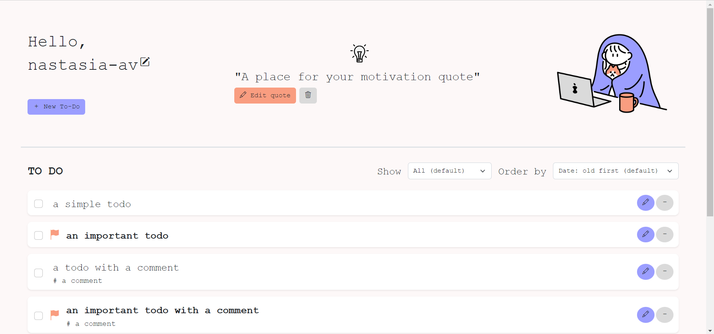

# A simple todo-list application
This is a minimalist planner app. Make your plans, add them to the list and mark completed. Built with Vue 3, Pinia and Bootstrap 5 with saving in Local Storage.

## Preview



## Project setup
```
npm install
```

### Compiles and hot-reloads for development
```
npm run serve
```

### Compiles and minifies for production
```
npm run build
```

### Lints and fixes files
```
npm run lint
```

### Customize configuration
See [Configuration Reference](https://cli.vuejs.org/config/).
